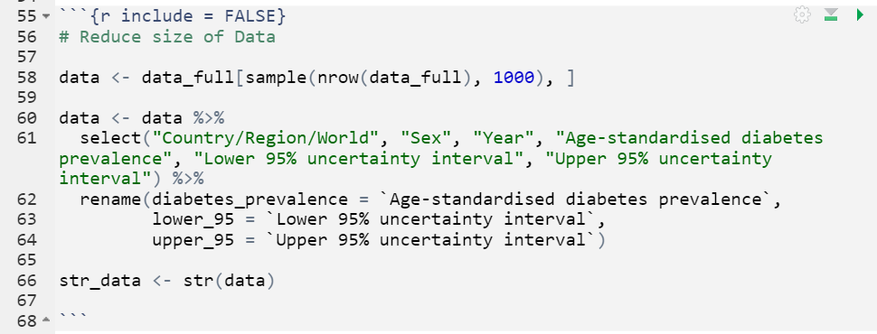

# Research Question

The aim of this analysis is to investigate diabetes prevalence over time and by country/region. The purpose is to identify countries and years with high diabetes prevalence. 


```{r warning = FALSE, message = FALSE, include = FALSE}
# Load libraries:
library(tidyverse)
library(gridExtra)
library(knitr)
```

# Dataset Introduction 

The dataset ['DIABETES evolution of diabetes over time'](https://www.ncdrisc.org/data-downloads-diabetes.html) is a global dataset of diabetes prevelance from the years 1980 to 2014 and contains a total of 14,000 observations and 7 variables: 
- "Country/Region/World", 
        - *e.g. "Turkey",  "Bangladesh", "New Zealand"*
- "ISO", 
    - *A region code for international standard denominations for country subdivisions*
- "Sex", 
    - *Two factor variable "Men" or "Women"*
- "Year", 
    - *Ranges from 1980 to 2014*
- "Age-standardised diabetes prevalence", 
    - *Calculated as a percentage*
- "Lower 95% uncertainty interval" and 
- "Upper 95% uncertainty interval". 
**Table 1** below shows the first six observations of the full dataset. 


```{r}
# Read in Data 

data_full <- read_csv("Data/Diabetes_data.csv")

data_full_head <- head(data_full)

kable(data_full_head, 
             caption = "Table 1: First Six Observations of the Full Diabetes Dataset",
             digits = 2)

```

# Dataset Description 

The full dataset was reduced to **1000** observations through a random generation of row numbers. The variable "ISO" was removed as it was not necessary for analysis.** Figure 1** below shows the code used to tidy the full dataset into the reduced dataset. 

```{r include = FALSE}
# Reduce size of Data 

data <- data_full[sample(nrow(data_full), 1000), ] 

data <- data %>%
  select("Country/Region/World", "Sex", "Year", "Age-standardised diabetes prevalence", "Lower 95% uncertainty interval", "Upper 95% uncertainty interval") %>%
  rename(diabetes_prevalence = `Age-standardised diabetes prevalence`, 
         lower_95 = `Lower 95% uncertainty interval`, 
         upper_95 = `Upper 95% uncertainty interval`)

```


```{r fig.cap = “Figure 1: Code Screenshot of Data Tidying”, fig.align='center', out.width="50"}

```

Using the function **str()** the first 2 rows of the data is displayed to show the type of variables in the data set (numeric, character/factor etc.). The assessment requires a maximum of **5** variables, but both the "lower_95" and "upper_95" were kept as they work together. 

```{r}
head_data_2 <- head(data,2)
str(head_data_2)
```

# Data Summary 

Two summary statistics were calculated for diabetes prevalence by "Year". **Table 2** shows the results of the summary statistics. 

```{r include = FALSE}
data_summary <- data %>%
  group_by(Year) %>%
  summarise(mean_diabetes = mean(diabetes_prevalence), 
            sd_diabetes = sd(diabetes_prevalence), 
            mean_upper95 = mean(upper_95), 
            sd_upper95 = sd(upper_95), 
            mean_lower95 = sd(lower_95), 
            sd_lower95 = sd(lower_95))
```

```{r}
tail_data_summary <- tail(data_summary, 10)

kable(tail_data_summary, 
             caption = "Table 2: Mean and Standard Deviation of Diabetes Prevalence by Year (First 10 Rows)",
             digits = 3, 
      row_number(10))
```

From **Table 2** we can see an increasing trend in mean diabetes prevalence from 2005 to 2014. **2009 had the highest mean diabetes prevalence at 11.1% from the period 2005 to 2014, but also the highest standard deviation**. 
